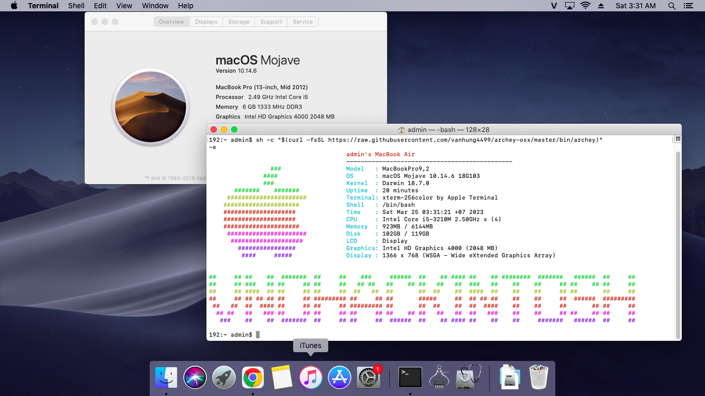

# Dell-System-Inspiron-5420 (Mojave)
## Specifications:
- **CPU:** i5-3210M
- **GPU:** 	Intel(R) HD Graphics 4000 (2112 MB)
- **RAM:** 6GB
- **Ethernet:** Atheros AR8162/8166/8168 PCI-E Fast Ethernet Controller
- **Wi-Fi:** Broadcom BCM4352 802.11ac Wireless Network Adapter
- **Sound Card:** Conexant Cx20590
- **Trackpad:** Standard PS/2 Keyboard
- **Disk Drive** TS128GSSD370S (D226800283)

## ✅ Whats workin'
* Graphics
* All USB ports
* Wifi, Bluetooth, Airdrop
* Ethernet
* Audio 
* CPU Power Management
* SMBUS
* Microphone
* Touchpad

# Screenshot:

## Credits
- [Apple](https://apple.com) for macOS.
- [Acidanthera](https://github.com/acidanthera) for OpenCore and all the lovely hackintosh work.
- [Olarila](https://www.olarila.com/) For great guides and offline installer.
- [Dortania](https://dortania.github.io/OpenCore-Install-Guide) For great and detailed guides.
- [VNOHackintosh](https://facebook.com/VNOHackintosh) Support group for installation and post installation.
- [Đỗ Ân](https://www.facebook.com/ando2001hn) Thank you for trusting to use our services.
